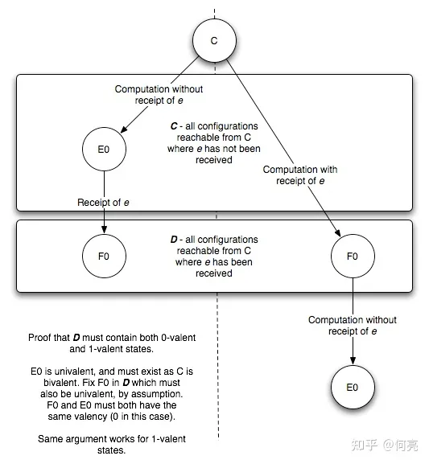

# FLP Impossibility的证明及思考

[TOC]

## Model

作为分布式系统历史中最重要的一个定理之一, FLP是每个做分布式系统的开发人员都应该深刻理解的一个基础. 但是FLP的证明过程不是特别容易, 原文中作者撰文非常简练精确, 本文通过一些例子和不太严格但是容易理解的语言来帮助读者理解FLP的证明过程.

Consensus定义:

1. termination: 所有进程最终会在有限步数中结束并选取一个值, 算法不会无尽执行下去.
2. agreement: 所有进程必须同意同一个值.
3. validity: 最终达成一致的值必须是V1到Vn其中一个, 如果所有初始值都是vx, 那么最终结果也必须是vx.

首先, 排除Byzantine式故障, 只考虑crash recovery故障模型. 消息系统是异步的, 但是任何消息都会被接收一次且仅一次, 并且无法伪造或者丢失。这是比一般的异步网络更加可靠的一个网络模型. 这样收窄的一个模型如果在只有一个faulty进程的情况下都不能有一个完全正确的consensus protocol, 那么在更一般的异步网络或者包含Byzantine故障的模型里，更不可能在有一个faulty进程的情况下有完全正确的protocol. 这里完全正确(totally correct)是指同时满足safety和liveness. 在实际应用中, Paxos, Raft, PBFT都是保证safety但是不保证liveness的, 所以他们都不是完全正确的算法, 理论上存在进入无限循环的可能性(实际上概率非常低, 在工程中完全可以使用). 在当时可以说这是一个非常令人震惊的结论了, 给我们日常工程中很多问题判了死刑，比如分布式系统的缓存一致性和可用性，比如分布式事务的一致性和可用性等等.

下面开始介绍论文中的模型， 这个模型是一个通用的Consensus protocol, 定义为: 异步网络中的N个进程(N不小于2), 每个进程都有一个输入xp和输出yp的寄存器, 每个p的输入xp取值为{0, 1}其中一个, 这叫做一个进程的初始状态. 每个进程的表决结果输出到寄存器yp里, yp的取值范围为{b, 0, 1}, 其中yp的初始状态必须为b, 一旦产生表决结果则变成0或者1, 这时候这个进程的状态叫做decision state, yp不可以再变化. 每次内部状态的变化过程叫做transistion function, 他是deterministic的.

因为表决值只能是b(未决定), 0, 和1, 所以这是一个比较简化的模型. 这个protocol记作P.

这个P模型中的进程之间通过消息通信, 一个消息e = (p, m). 其中p是目标进程, m是消息值. 整个消息系统叫做message buffer, 相当于一个multiset(每个进程拥有自己的FIFO消息队列, 如同erlang信箱一样). message buffer里包含着已经发出但是还没有收到的消息. message buffer支持两个操作:

1. send(p, m): 把一个消息(p, m)放到message buffer中.
2. receive(p): p从message buffer删除并取得消息值m, 或者返回null. 前者表示消息被接收到, 如果message buffer为空后者表示没有p的消息, 如果message buffer为空表示无消息，或者p的消息传输被延迟（message buffer内的消息不变化）. 注意, p的消息被延迟的次数有上限, 任何消息最终都会被收到.

一个configuration(状态)就是指所有进程的内部状态和message buffer状态. 整个系统总是从一个configuration变化为另外一个configuration. 这个变化过程叫做step, 一个step取决于message buffer返回消息的情况, 因为receive(p)返回的是M还是null, 而transition function是deterministic的, 所以下一个configuration取决于message buffer的返回值. 这个消息被接受处理的过程叫做event(p, m), 消息被延迟的事件叫做event(p, null). 这些steps叫做一个run, 如果结果的configuration有任何一个进程的yp={0,1}那么着叫做一个deciding run, 这个configuration已经有了表决结果. 因为只要有一个进程能够进入decision state，那么整个configuration就算是0-valent或者1-valent了.

一个configuration的一个schedule(事件序列)记作𝞂, 它包含了从这个configuration起, 一系列的事件. 比如(p1, m1), (p2, m2), (p3, m3)….

因为P是deterministic的，所以给定一个schedule能得出确定的结果。那么我们定义，如果一个configuration不需要依赖之后发生的事件，在当前的时间就能确定自身的状态，则称为n-valent。这个模型中有三种结果，yp = {0, 1, b}, 如果一个configuration如果无论后继的事件如何都会进入选择0的状态, 这叫做0-valent；如果总是会进入选择1的状态, 这个configuration叫做1-valent；如果当前还不能确定结果，还需要后继的事件才能确定结果是0还是1，那么这个configuration叫做bi-valent.

另外，对于论文中的模型，我们对本文开头的Consensus第二个条件弱化为只要有一个进程进入decision state即可。(这是为了简化模型)

至于论文中定义non-faulty进程为：

> A process p is nonfaulty in a run provided that it takes infinitely many steps,and it is faulty otherwise.

所以faulty process定义就是可能执行了若干steps但是后来停止了的进程。这个概念非常重要，在证明的Lemma2和Lemma3中都需要引入一个faulty process p which takes no steps。

最后论文定义了什么是partially correct和totally correct.对于一个P partially correct的定义为满足两个条件

1. No accessible configuration has more than one decision value.
2. For each v∈(0, I), some accessible configuration has decision value v.

对于一个P totally correct的定义为满足两个条件

1. 他是partitially correct的。(agreement and valid)
2. 每个有执行进度的run都是会进入终态的。(termination)

我们现在有了一个模型，然后论文开展了三个Lemma最后拼成结论。

## Lemma 1

> Suppose that from some configuration C, the schedulers 𝞂1, 𝞂2 lead to configurations C1, C2, respectively. If the sets of processes taking steps in 𝞂1 and 𝞂2, respectively, are disjoint, then 𝞂2 can be applied to C1 and 𝞂1 can be applied to C2, and both lead to the same configuration C3.

这条引理表示如果一个C里有两组事件, 每个事件(p, m)分别是在两组没有交互的进程上, 那么先使用任何一组事件再使用另外一组事件在C上, 结果都一样. 下图描述了这样的情况.

这个引理太容易理解了, 就不做证明了. 不过我们可以举个例子来描述一下: 比如Paxos的两阶段算法中, 假设有A, B, C, D，E五个节点, 𝞂1是B收到了A的第一阶段消息, 𝞂2是D/E收到了C的第一阶段消息(假设网络有延迟，D/E还没收到A的第一阶段消息，B还没收到C的第一阶段消息). 因为A/B是一组进程, C/D/E是一组进程, 𝞂1和𝞂2分别作用于这两组不相交的进程上.那么无论是先𝞂1, 𝞂2的顺序被送达还是按照𝞂2, 𝞂1的顺序, 最终结果都是C3。前面模型中提到的message buffer可能返回空就很好的模拟了这种消息延迟或者短暂的发生网络分区的情况.

## Lemma 2

> P has a bivalent initial configuration

任何一个协议P一定会有bivalent初始configuration. 这是由于异步网络的本质造成的. 因为异步网络的消息顺序不一定, 所以对同一个初始configuration都可能会运行产生不同的结果. 证明如下:

反证法, 假设协议P没有bivalent initial configuration, 那么P的initial configuration不是0-valent就是1-valent. 我们把所有只差一个进程的p上的xp变量不同的两个initial configuration叫做相邻(adjacent).

由本文开头提到的Consensus的第三点validity要求, {0,0,0}一定是0-valent的，而{0,0,1}和{0,1,1}可能是0-valent的，也可能是1-valent的。也就是说一个initial configuration中的xp只要包含了0，那么就有可能是0-valent的，如果xp包含了1，那么就有可能是1-valent的。但是如果全部xp都是0的configuration一定是0-valent的，同样全部xp都是1的configuration也一定是1-valent的，所以如果P没有bivalent initial configuration那么一定是同时包含了0-valent 和 1-valent的initial configuration(因为initial configuraiton至少包含了{0,0,0}和{1,1,1})。

进一步思考, 并使用前面提出的adjacent的概念，因为同时存在0-valent和1-valent的initial configurations, 假设他们是C和C’, 那么从C到C’一定有一个路径上, 至少存在一处adjacent的C0和C1, 使得C0是0-valent, C1是1-valent. 下图是一个只有三个进程(p0, p1, p2)的所有initial configuration(xp1, xp2, xp3)的情况, 线条连接的是相邻的两个initial configuration. (注意，这里的路径不是指变化路径，他只是表示initial configuration的相似性)

为什么说“一定存在相邻的C0和C1“呢？看这个图，明显{0,0,0}肯定是0-valent, {1,1,1}肯定是1-valent，那么我们把他们当作C和C’, 显然这是个连通图，所以他们俩是reachable的，那么他们之间的某个路径上一定存在从0-valent变化到1-valent的地方。这个例子中在{0,0,0} - {0,1,0} - {1,1,0} - {1,1,1}这条路径上, {0,1,0}和{1,1,0}很有可能就是C0和C1的分界点(假设{0,1,0}是0-valent，{1,1,0}是1-valent), 也可能在其他路径上，比如如果{0,1,0}是1-valent，那么分界点就在{0,0,0}和{0,1,0}了。无论如何一定存在一对相邻的initial configuration分别是0-valent和1-valent。

假设p是C0和C1这两个initial configuration之间初始状态不同的那个进程, 如果p是faulty的（原文takes no steps）, p不再从buffer里获得任何消息也不发送消息, 那么C0和C1如果排除了p之后其实状态是一样的, 那么排除了p之后C0上的某个事件序列𝞂也可以应用在C1上, 而且结果相同. 假设结果是1，因为C0是0-valent的, C0不应该得到1，这就矛盾了。同样，如果结果是1，C1是1-valent的, 也矛盾了。

这个引理的本质是:一个故障节点停止接受消息, 会使结果不确定偏离原本的预定结果（原本C0/C1分别确定0和1，引入一个faulty process之后结果相同，要么都是0要么都是1）. 举个例子, 我们设计一个consensus算法, 规则如下: 有A/B/C三个节点, A作为leader对B/C做类似于两阶段提交的询问, A先告诉B/C期望的结果, B/C接受并返回应答, 只有收到应答之后A才能做出决定并发出第二个请求给B/C做提交, 如果A发生了故障, 那么B作为leader对C询问. 我们要求这个算法允许一个faulty节点但是不影响结果正确性。那么我们设计一个0-valent的C0和一个1-valent的C1分别如下:

C0=A建议0给B/C. B/C自己都倾向于1. (C0={0,1,1}并且它是0-valent)

C1=A建议1给B/C. B/C自己都倾向于1. (C1={1,1,1}并且它是1-valent)

明显, 如果没有任何故障, C0结果是0, C1结果是1. 因为C0和C1只差一个进程A不同, 假设A进程挂了, 那么C0’和C1’其实是一样的, 这时候他们俩结果应该是一致的, 应该都是1. 但是这和C0就算有一个faulty节点也应该结果为0矛盾, 所以在**一个faulty process存在的情况下**不可能所有的initial configuration都是确定0-valent或者1-valent的，一定存在不确定的initial configuration.

我们通过反证法证明了一个协议P必然包含bivalent initial configuraiton. 本质上这是异步网络中一个没有响应的节点导致的结果不确定性. 其实Lemma 2如果这样讲会更容易理解：

> P has a bivalent initial configuration when there is a faulty process.

这个Lemma说明了如果有一个faulty process，那么开始的时候就有不确定性了。接下来我们还要证明起始不确定，发展也会不确定。

## Lemma 3

设C是一个双值格局，事件e=(p,m)是一个可以发生在C上的事件。我们令ℂ表示从C格局出发不经过事件e可以达到的所有可能格局的集合，令D表示ℂ里面的每个格局都经过事件e得到的格局的集合，则D里一定仍包含双值格局。

这个描述有点绕，我们先看看如果它成立，能达成什么效果。前面引理已经证明了初始格局里一定有双值格局，我们拿一个这样的格局出来，再找一个接下来要发生的事件e，那么我们总可以通过把事件e推后到某个合适的时间发生，使得之后得到的格局仍然可能是双值格局(i.e.未能做出决定的格局）。从这个新双值格局继续同样操作，那么就可以永远留在双值格局，不做出最终决定。这样这个共识算法就不能终止了。

还是用反证法，假设D里不包含双值格局，我们试图推出矛盾。

若D不包含双值格局，我们可以得出D里必须两种单值格局都存在。(1)

这一步的证明是这样的：因为初始格局C是双值的，那么一个存在一个0-单值格局E0和一个1-单值格局E1可以从C到达。我们先看E0，一种可能是E0属于ℂ集合，那么F0=e(E0)就属于**D**集合，显然F0也是0-单值的；另一种可能是E0不属于ℂ集合，这时一定在D里存在一个F0使得从F0可以到达E0，因为**D**里只有单值格局，那么F0一定是0-单值的。综合两种情况，**D**集合里必然有0-单值格局。同样的逻辑对E1也成立，所以**D**集合里也必然有1-单值格局。故(1)得证。

简化一点来说就是，对于E0，我们一定能在**D**里找到一个单值格局F0，使得要么能从E0到F0，要么能从F0到E0。下面这个盗来的图形象描绘了这一部分证明：

现在我们知道**D**里面两种单值格局都有了，因为**D**里的每个格局都是从ℂ里的某个格局经过一步e得到的，那么我们一定能在ℂ里找到相邻的两个格局C0,C1，使得D0=e(C0)是0-单值格局，而D1=e(C1)是1-单值格局。不妨设是C0经过一步e’得到C1。（若则C1经过一步到C0下面的讨论也同样成立）

此时对e' =(p', m')有两种情况，

**情况一：若p’不等于p**，也就是说e和e’是作用在不同的节点上的。那么根据交换律，交换e和e’的顺序结果应该不变。我们已经知道了C0通过e’到达C1再通过e到达D1。还知道C0通过e到达D0，此时如果让D0接受事件e’，因为满足交换律我们应该也得到D1。但这是不可能的因为D0已经是单值格局不能变了，所以得出矛盾。见下图：

**情况二：若p’等于p**，此时从C0出发必存在一个不涉及节点p的事件序列R，能达到一个单值格局A。（因为我们的算法要在有一个节点挂了的时候仍能正常运行，现在就好比是p点挂了）现在我们让D0接到序列R，设结果为E0，也就是说E0=R(e(C0))。因为R不涉及p，根据交换律，我们让A接收事件e后，也应该得到E0，也就是e(A)=e(R(C0))=R(e(c0))=E0。类似地，我们让D1接受序列得到E1，也就是说E1=R(e(e'(C0)))，同样根据交换律，A接收事件e和e’后也应该得到E1，e(e'(A)) = e(e'(R(C0))=R(e(e'(C0)))=E1。但是，A已经是单值格局了，不可能既能到E0又能到E1，得出矛盾。

综合以上所有这些矛盾，说明我们一开始的假设“**D**里不包含双值格局”是不正确的。D里必定包含双值格局。所以我们前面说的这个构造无限序列的方法就成立了：

> *前面引理已经证明了初始格局里一定有双值格局，我们拿一个这样的格局出来，再找一个接下来要发生的事件e，那么我们总可以通过把事件e推后到某个合适的时间发生，使得之后得到的格局仍然可能是双值格局(i.e.未能做出决定的格局）。从这个新双值格局继续同样操作，那么就可以永远留在双值格局，不做出最终决定。这样这个共识算法就不能终止了。*

所以原始的命题得证：在异步网络中，只要有一个节点有可能挂，理论上就不存在一定能在有限时间内结束的共识算法。

## 思考与总结

我们看到，在分布式协议中，safety和liveness是一对冤家，不可能同时满足，所以大多时候，我们选择要safety而放弃一定的liveness，同时，基于类似于raft的共识协议实现ETCD，我们可以更容易做出好的，简单的架构：如果我们所有的服务器路由都基于ETCD心跳机制，那么我们可以认为：所有服务器之间有最终可达性(因为不满足ETCD心跳机制的节点会被剔除，那么剩下来的节点和ETCD都有双向连通性，差不多等于所有节点都是互相连通的)。所以接下来我们设计自己的架构时，我们的model就不必像论文中这么复杂了，而是可以简单的认为所有节点之间都是网络可靠的,no crash的。同时raft协议指导我们，如果需要safety却有不能满足的情形，那我们可以牺牲一段时间liveness，直到safety可以满足为止。