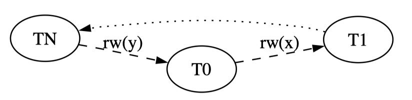
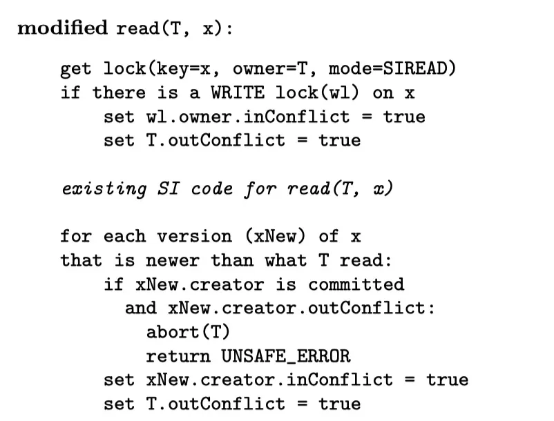
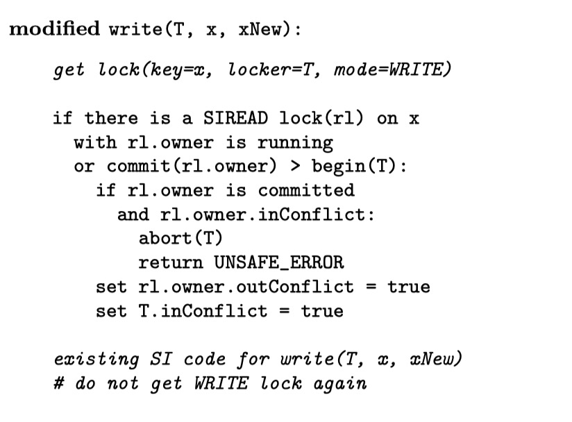
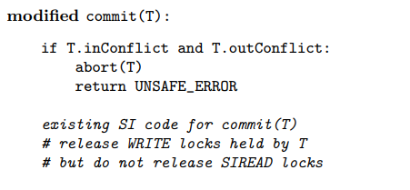

# Make snapshot isolation serializable

## 理论基础

如何让 SI 达到 Serializable？只要找出可能发生异常的情况，并且拒绝事务提交就可以了。所以问题的关键是识别出（可能会） non-Serializable 的事务。

为了解决这个问题，我们引入 multi-version serialization graph (MVSG)，这个图上的点代表一个事务，边代表事务之间的 dependency：

对于某一个object x：

- ww-dependency：T1 写入了x，T2又写入了一个更新版本的x
- wr-dependency：T1写入了x，T2读取了x
- rw-dependency: T1读取了x，T2写入了一个更新版本的x

对于一个简单的 write-skew（比如文中那个医生值班的例子），它的 MVSG 图如下图所示：

引用另一些论文的结论：所有 write skew 异常**一定会包含如下图（右）所示的结构**，即：不仅存在环，而且**环上一定存在两个连续的 rw-dependency**(这个结论的证明见论文：[Making Snapshot Isolation Serializable]([ACMJ059-05.tex (iitb.ac.in)](https://www.cse.iitb.ac.in/infolab/Data/Courses/CS632/2009/Papers/p492-fekete.pdf)) )

换句话说，如果存在一个事务 T，他既是一个 rw-dependency 的 reader、又是一个 rw-dependency 的 writer，那就要注意了，它可能导致 non-Serializable，必须中止它的提交。

注意：“存在两个连续的 rw-dependency” 是"non-Serializable" 的必要条件而非充分条件，所以，确实存在一些“误杀”（false positive）的情况。这是可以接受的。要想确保不误杀需要检测是否存在环，该操作的overhead太高、无法接受。

## 算法实现

我们给每个事务 T 加上两个布尔值：T.inConflict 表示存在入边（即，读过的数据被其他事务写了新版本），T.outConflict 表示存在出边（即，更新了其他事务读过的数据）。如果 T.inConflict == true 且 T.outConflict == true，则对应于上面说的那个危险情形（连续的 rw-dependency），此时 T 应当被中止。

另外，增加一种新的锁 SIREAD，它不和任何锁冲突，只是充当个标记而已。所有事务中的读都要加一个 SIREAD 锁。SIREAD 可以异步地清理，不影响正确性。

算法主要作用于 read 和 write 的过程：

- 对于 read，我们要检查这个数据有没有被其他事务写过。“其他事务”包括：
  - 一是正在进行的事务（依靠write lock来发现，他们的commit时间戳必然更大）
  - 二是已经提交的事务，并且其commit时间戳比当前事务的start时间戳更新

- 对于 write，我们要检查这个数据有没有被其他事务读过，这是通过检查 SIREAD 锁来发现的。类似的，“其他事务”包括：
  - 一是正在进行的事务（同上，他们的commit时间戳必然更大）
  - 二是已经提交的事务，并且其commit时间戳比当前事务的start时间戳更新

经过以上检查更新 T.outConflict 和 T.inConflict，如果发现它们都是 true，则立即中止事务（图中抛出 UNSAFE_ERROR）。

- 对于commit，检查T.outConflict 和 T.inConflict是否都是true

以上实现还有个问题：如果有 predicate read （例如 `select * from t where k < 50 and k >= 40`），要对范围加锁才行，不然会存在 phantom 问题。论文的实现是基于 BerkleyDB 的，它的锁粒度是 page，因此不存在这个问题。对于其他数据库可以用 gap lock 来实现，但是其实在现代DBMS中，这通常通过记录 predicate 来实现。
