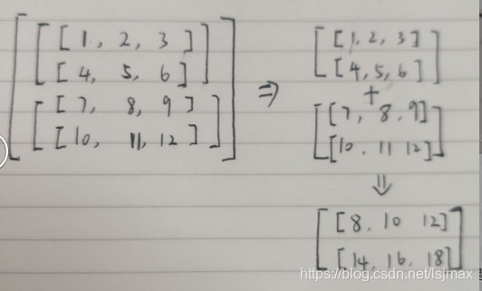

Numpy中维数
numpy能够实现高维矩阵的运算，但是当维数超过3后，就能难理解根据某个轴进行运算的操作过程（太抽象了）。二维矩阵，就是有行和列，axis=0，对应是行，axis=1，对应是列，通过2个下标确定具体某个元素的位置，三维则需要三个下标确定某个元素的位置。

Numpy维度的直观理解
对应三维矩阵，那么里面的具体的元素是被三个[]所包围的，最外层[]对应于axis=0，即第一维，次外层[]对应于axis=1,即第二维，最里层的[]对应axis=2,即第三维。

多少个维度，就对应有多少个[]。

三维数组，sum（axis=i）的理解。
二维数组的对固定某个轴进行加减排序不难理解，但是达到三维及以上就比较难直观理解了。这里以三维数组为例，更高维度情况类似。
np.sum(axis=0)
这是按照第1维进行数组的求和。

对于axis=0,就对应于第一个[]，那么从这个[]往内看，子单位是两个二维数组，sum(axis=0)就是这两个二维数组的求和，那么就是这两个二维数组对应位置的元素相加，就得到了结果，求和后就消掉了第一维度，降维了，变成二维矩阵。
也可以这么理解，就是将元素第二和第三个下标相同，第1个下标不同的元素相加得到。a[0][0][0]+a[1][0][0]。

np.sum(axis=1)

对于axis=1时，对应于第二个[]，那么从这个[]往里看，子单位是两个一维数组，sun(axis=1)就是这两个一维数组，相对应的元素相加。这时，第二维度就消失了，变成二维数组。

np.sum(axis=2)

对于axis=1时，对应于第三个[]，那么从这个[]往里看，子单位是三个元素，sun(axis=3)就是把这三个元素相加。这时，第三维度就消失了，变成二维数组。

对哪一维进行操作，即对哪一层的[]内的子单元进行正常数组的操作。

三维数组，sort（axis=i）的理解。
同理，对三维数组进行某一个维度上的排序，也是根据第几个维度对应的[]内的子单元进行排序。
np.sort(axis=0)

sort(axis=0),对第一维进行排序，就是看第一层的[]，里面是两个二维数组，就是这两个二维数组进行排序，如何排序呢，去了最外层的[]，这两个二维数组，就是两个独立的数数组，就进行同一所有位置的元素进行比较大小，进行位置交换，如 上面数组[0][0]=3,和下面数组[0][0]=1相比较，上面的3大，因此交换位置，其他位置的元素也同理进行比较，操作若为sum(axis=0),那么就是这两个位置的元素相加（3+1）。

np.sort(axis=1)

sort(axis=1),对第二维进行排序，就是看第二层的[]，里面是两个一维数组，就是这两个一维数组进行排序，就进行同一所有位置的元素进行比较大小，进行位置交换。[3,1,5]和[2,4,1]进行相应位置元素的比较排序；[1,7,10]和[6,9,8]进行相应元素的比较排序。

np.sort(axis=2)

sort(axis=2)对第三维进行排序，就是看第三层的[]，里面是三个元素，那么就是这三个元素就进行排序，有四个第三层的[]，就是每个[]里元素进行单独排序。

总结
numpy中中对数组的指定axis进行操作，就看对应的是哪个[]，把这个[]里的子单元，看成是多个独立的低维数组，进行相应的操作。反之，知道原理后，可以根据想要对哪个维度进行操作，就得到推出axis该设为几了。