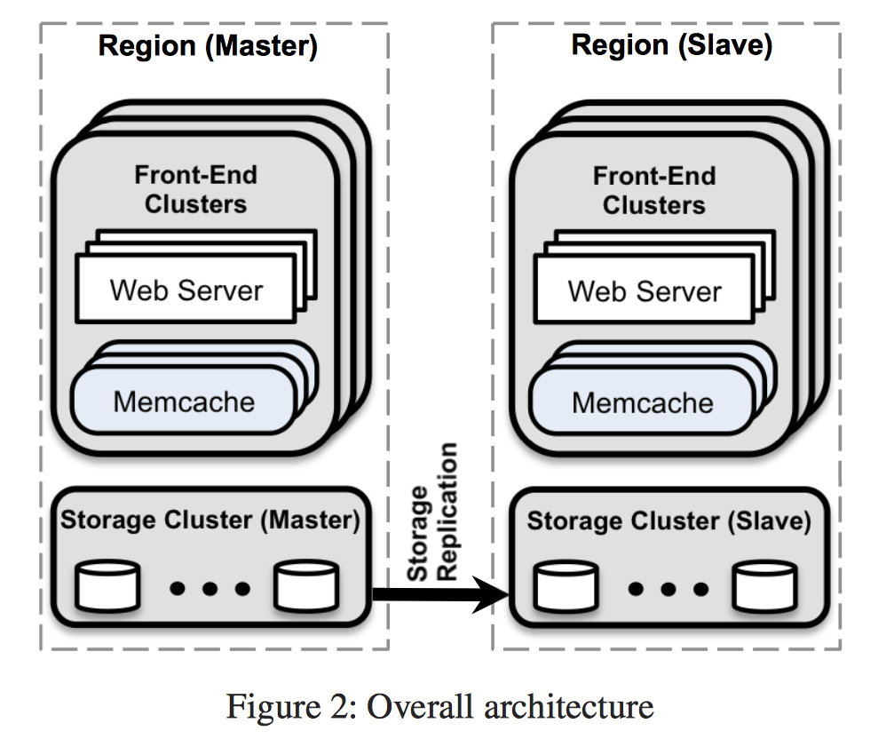

# Scaling Memcache in Facebook

### 导读

在一个分布式的系统中，即使有了类似于Zookeeper之类的协调服务之后，如何设计一个分布式系统也是一个很有挑战性的话题。首要的分布式系统中的问题是：如何保证一致性？我们设计的所有一致性的协议基本都是lease based的，而且是两阶段的，所以两阶段和lease based(如:短期的lease 基于version的，长期的lease按照心跳时间的)是分布式一致性设计的最关键的步骤。分布式环境下是绝对不允许lock这种东西存在的，因为可能造成永久的block。

下面我们就来读一下这篇论文，是如何利用lease和2pc实现大规模的webserver服务。

**整体架构**

从小到大每个组成单元：

1. Web Server是网站服务器，memcached是一个独立运行的Binary
2. 一个Cluster由一些Web Server和一些memcached组成。一般而言，Web Server只向同一个cluster的memcached进行读写操作
3. 一个Region由多个Cluster组成，这些Cluster共享同一个Backend Service（数据库，或者提供特定计算结果的后端服务）
4. 一共有多个Region，不同Region之间可能存在Replication

然后数据传递的过程大概是：

- 读
  - cache hit：直接返回
  - cache miss：fallback到后端服务，取回数据，然后客户端拿这个数据去更新一下memcache
- 写：服务器往数据库里写，然后把memcache里对应的数据invalidate掉

下面是整个系统针对不同问题所作出的优化努力

**A. 在同一个Cluster里，降低延迟和负载**

**A.1 延迟**

A.1.1 第一个优化是把数据请求一批一批，每一批并发来做。Facebook内部的异步编程使得Web Server能够建立起数据的依赖关系，得到一个DAG（有向无环图），然后没有依赖关系的数据就可以作为一批（batch）并发请求。每个batch的大小平均而言是24个。

A.1.2 客户端－服务器端通信

不同memcached服务器之间并不通信，一切工作都在客户端进行。客户端主要的工作是，给定一个key，它要知道应该到哪个memcached server去取数据。这个过程称为routing。客户端routing的逻辑，可以作为一个库直接嵌入到Web Server里面，也可以作为单独的程序运行。

客户端和服务器端通信的时候，UDP和TCP都用。在get请求的时候，用的是UDP，这样就不用像TCP那样还要握手建立连接。如果客户端发现丢包了，直接作为错误报出，而并不会尝试找回丢失的包。这时Web Server会把这当作cache miss处理。使用UDP把latency的平均值降低了20%左右。另一方面为了可靠起见，update和delete都采用TCP。

如果在网路中的包太多，就会发生Incast Congestion的问题（可以理解为，network有很多switch，router啥的，一旦一次性发一堆包，这些包同时到达switch，这些switch就会忙不过来）。应对这个问题就是不要让大量包在同一时间发送出去，在客户端限制每次发出去的包的数量（具体实现就是客户端弄个队列）。每次发送的包的数量称为“Window size”。这个值太小的话，发送太慢，自然延迟会变高；这个值太大，发送的包太多把network switch搞崩溃了，就可能发生比如丢包之类的情况，可能被当作cache miss，这样延迟也会变高。所以这个值需要调。

**A.2 降低负载**

A.2.1 租约(Lease)。租约解决的问题有两个：

1. Stale set，就是一个client拿着过期的数据往memcache里塞
2. Thundering Herd Problem.

租约的实现细节如下：每次cache miss，memcache会给客户端返回一个token，告诉它我这没有数据，你去取数据，取完拿这个token来更新我这的数据。如果有多个客户端同时读，同时cache miss，那么它们就会同时收到各自的token。但是，在接受数据更新的时候，比如A，B先后拿到一个token，A拿Token更新完之后，B再拿Token过来更新就不认了。如果系统收到了一个delete请求，那么啥token都不管用了。

再进一步，我们可以限制发token的频率，比如每10秒最多发一个。然后对于那些拿不到token的，既然有别人去拿数据去了，何必让它们再去拿？就让它们等待一小段时间再重试。大部分时候，更新后的数据在几毫秒后就来了，它们再重试就是cache hit了。

这个设计还是很精妙的。

A.2.2 过期数据(Stale values)

如果应用程序层可以忍受稍微过期一点的数据，针对这点可以进一步降低系统负载。当一个key－value被删除的时候（delete请求或者cache爆棚清空间了），它被放倒一个临时的数据结构里，会再续上比较短的一段时间。当有请求进来的时候会返回这个数据并标记为“Stale”。对于Facebook大部分应用场景而言，Stale Value是可以忍受的。

A.2.3 Memcache池（memcache pool）

在不同应用场景之下，对memcache的读取规律（access pattern）是可能大为不同的。比如有些访问率高，有些访问率低；cache miss有时无所谓，有时候很昂贵（比如计算一次时间特别久）；有时上一周用到的key跟这一周用到的key基本一样(low-churn)，有时差别很大(high-churn)。

拿最后一个例子来说（low-churn vs. high-churn)，服务器A使用的key万年不变，就在那么一小堆里来来去去；服务器B使用的key基本什么都有可能。如果它们使用同一个Pool，那么服务器B因为经常换新key，就会把A的key给频繁踢掉，而理想情况下，A使用的pool应该基本上就不用更新key的。这样就会造成很大的性能浪费。

所以，针对不同的需求，设立不同的pool是很有必要的。

A.2.4 数据复制(Replication)

最后一个降低负载的手段是在每个Pool内进行Replication。想象如下情景：我们有一台memcache机器，可以支持500K/s的请求率(request rate)。现在我们想要支持1M/s的请求，怎么办？加一台机器，然后把数据平分，两台机器一人一半？但是，客户端在请求的时候，一般是多个key作为一个batch发出来。假如原来是每个request要读100个key，那么现在就是分成两个request，每个request读50个key，然后同时扔给两个机器。由于每台机器接受请求的数量还是受到500K/s的限制，那么总的request rate还是500K/s。

那如何破？就是加一台机器，然后把数据完整复制到那上面。现在客户端还是一次发一个有100个key的读，但是有50%发到老机器，50%发到新机器。这样就能支持500K/s * 2的请求率了。

**A.3 应对系统崩溃**

系统崩溃有大有小。对于大规模的服务器失联，一般就直接把对应的cluster直接取下来，把web server的请求重定向到别的cluster的memcache。这种情况不常见，应对方法也比较简单粗暴。

对于小规模的outage，就需要注意。一方面小规模事故不足以让我们把整个cluster取缔掉，但是放任不管，也容易造成连锁反应：cache miss太多，导致Web Server全部直接访问后端服务，后端服务顶不住，挂了，或者后端数据库顶不住，也挂了，然后全站就挂了，句号。论文里提到的应对的办法就是设立一堆专门的应急memcache服务器（Gutter）。一旦一个get请求没有任何响应，客户端默认那个server挂了，转而请求Gutter。这个优化带来的影响是：

> In practice, this sys- tem reduces the rate of client-visible failures by 99% and converts 10%–25% of failures into hits each day

**B. Region Replication**

（Region感觉不好翻译，类似于data center的概念吧）

前面我们谈到把一堆Web Server和一堆Memcached作为一个Cluster。但是一个Cluster是不能无限Scale up的，因为每个Cluster里面都是多对多的Connection，也就是说是N^2的connection上限，这样N越大，就会：

1. Hotkey 访问量越来越大，最终搞得有hotkey的那个server hold不住
2. 网路堵塞各种丢包
3. ...

所以，论文提到建立多个Cluster （为了区分，后面把这种每个里面包含一定数量的Web Server和memcached的cluster称为Frontend Cluster），把它们和一个Storage Cluster组合起来，组成一个Region。所有Frontend Cluster共享同一个后端服务。

这样相当于是用空间换时间：同一个key在每一个Frontend Cluster都可能有一个Copy，这样会带来consistency的问题（后面会讲怎么解决），但是这样能够降低latency和提高availability。

**B.1 Regional Invalidation**

这里要解决的问题是：Cluster A的某个Server修改了后端数据库里面的值，如何把这个值被修改了的消息传播到所有的Frontend Cluster，好让它们把本地memcached对应的旧的数据清掉？

一种简单的方式是让那个做出修改的Web Server负责通知同一个Region里所有Cluster的所有memcached，但基于我们上面说到的种种理由，这样performance会很差，而且还容易由于routing的配置出错，所以这种操作只能现在在同一个Cluster里。

那么对于其他Cluster，解决办法是让Storage Cluster来负责把消息广播出去。Storage layer采用的是Mysql，而Mysql对于数据更新是有日志的。第一步首先在日志内容里加上对应的memcached key，然后设立一个进程监听日志，发现有数据更新，就解析出对应的key，然后把消息广播给所有的memcached。

这里有一点要注意的是我们不能让数据库直接跟memcached通信，原因包括但不限于：

1. 这样通信连接太多
2. 这样还得把routing逻辑放到后端逻辑里

所以每个cluster里面有专门的server，运行mcrouter进程（还记得前面说过routing逻辑可以作为库函数嵌入，也可以作为单独的进程运行吧）。广播消息会发送给这些进程，再由它们负责传给本cluster的memcached。

**B.2 Regional Pool**

每个Frontend Cluster都有自己的memcached pools，我们姑且把它们称作cluster pool吧。与之相对的Regional Pool顾名思义就是被所有cluster共享的memcached pool。为什么要设立这样的pool呢？

主要原因是，有一些数据，访问频率低，本身占内存还多，这样的数据放到每个cluster里复制一份，要占用很多额外的内存。所以把它们放到Regional Pool里面就可以减少内存占用。虽然Regional Pool的latency会相对更高（因为要穿越cluster的边界），但是由于它们访问频率不高，所以也就显得不那么有所谓了。

论文提到目前是靠人的经验来觉得什么东西放Regional Pool的，不知道现在是不是做到自动化了。

**B.3 Cold Cluster Warmup**

当我们起一个新的cluster，或者把cluster拿去维护，等等等等之类的，这个cluster的cache基本是没东西的，所以基本很大概率是各种cache miss，然后要等很久才能填得比较满，而且这样也会给后端服务带来很大压力。

解决办法嘛，很容易就能想到，允许这个cold cluster在cache miss的时候，把别的“warm cluster”（就是cache有比较多数据的cluster）当作storage cluster去那边读数据，这样原来需要几天时间才能完成的warm up在几个小时之内就能完成。

但是这样又带来了新的问题。想象下面这个情景：Cluster A某个Server往Storage里更新了一份数据，后端在完成数据更新后会把数据过期的消息发送到其他的Cluster。同时Cluster A里某个Server读这份数据的时候发现cache miss，然后从Cluster B里读；如果恰好Cluster B此时还没有收到数据过期的消息（因为消息传递也是要时间的），这个读会成功返回，然后这个Server拿到事实上已经过期的数据后会往Cluster A的memcached里写。这样子就相当于Cluster A的memcached就存放了一份过期的数据，而且这份过期的数据可能被保留很长甚至无限长的时间。

解决办法是：memcached支持一个功能，在对一个key进行delete操作之后锁住这个key一段时间不允许进行add操作。通过在cold cluster里设置这段hold-off时间为大于0的值（2秒），在上面的场景中，由于前面那个更新的Server是对本地memcached进行了delete操作的，第二个server拿着过期数据往里写的时候就会报错，然后它就知道这个数据在Storage里面有新值，就会去读最新的值再往里写。理论上过期数据还是可能出现的，但是可能性大大减低了。

**C. Cross Regional Consistency**

FB的数据中心分布在不同地方，互相之间数据需要保持一致性，这部分就是讲在数据库和Memcache层面保证数据正确性的。

首先，底层数据存储用的是MySQL（跟开源版本不完全一样，有一些Facebook自己的强化），采用Master-Slave Replication（主从复制）架构，其中一个Regional作为Master Region，接受所有的Write，然后通过MySQL本身的Replication把数据更新广播到其他Slave Region。这是数据库层面，简单直接。

那么Memcache层面呢？如果是Master Region的Write，那好办，完全照搬之前的流程：

1. Web Server往数据库发更新，然后invalidate local（同一个Cluster的） cache
2. 同一个Cluster的Web Server遇上cache miss会从数据库拿新的数据然后往cache写

但是如果是非Master Region，就不能照搬了，因为更新是往Master Region发，而这个更新可能要很久才会被广播到当前的Region。一旦local cache被清掉，别人来读发现cache miss了，但是新的数据还没传到本Region的数据库，这时候别人就会读本地数据里那个实际上已经过期的值往cache里写了。这么一写，这个陈旧数据就可能不知道会存活到何年何月了。

要避免这种情况发生，就得保证本地cache被清掉了，但是本地数据库还没有最新数据的时候，要到Master Region去拿正确的数据。所以步骤如下。假如一个Web Server要更新一个key k：

1. 先在某个地方放一个标志Rk。这个标志的含义就是我更新数据了，但是这个更新数据还没到我这个Region的数据库。
2. 把k和Rk一起放在SQL里发给Master Region
3. 清掉本Cluster的k
4. Master Region收到更新后会把同样的更新广播到本地Region
5. 本地Region收到后负责把其他Cluster的k，和之前的标志Rk删掉

然后别人的读如果发生在3之后，5之前，它就会看到Rk存在，于是它就不会去读本地数据库去拿数据，而是直接访问Master Region的数据库，这样就能很大程度上保证读到的数据不是过期的。

这就是大概的思路。至于实现细节，Rk是放在Regional Pool中的，被整个Regional共享（读到这里真是感觉人生如此巧妙，需要某个东西的时候恰好可以拿现成的东西来用，这种感觉真是太爽了）。

*论文里还提到一个历史细节：在需要扩张到多个Region之前，其实清空cache过期数据的工作其实完全是靠Web Server来干的。前面说过Web Server跨Cluster干这种事情已经很蛋疼了，还要跨Region就太不实际了（而且还容易发生Race condition），于是才把这部分逻辑放在后端。这个故事告诉我们系统是逐渐演变的，没有一步到位的完美系统。*

**D. Single Server Improvement**

这部分讲的是如何提高单个服务器的性能。

**D.1 基本优化**

基本的优化有三个

1) 允许Hashtable自动扩张（否则冲突太多的时候，look-up time会趋向O(n))
2) 从单线程变成多线程，通过全局锁来保护数据结构
3) 每个线程使用单独的端口通信

然后在此基础上

1) 把全局锁改成粒度更小的锁，使得throughput提高
2) 使用UDP而不是TCP来通信，使得throughput大致提升了10%（论文做了两个实验，分别是8%和13%)

**D.2 Slab Allocator**

Slab Allocator是Memcached的内存管理模块。它的算法大致是：

1. 定义不同的内存块大小(slab class)，从64 bytes等比数列一直到1M （1.07 factor)
2. 每个slab class会对应一堆预先分配的内存块
3. 每当需要放什么东西的时候，它会找对应大小的slab class，然后从这个class对应的内存块里找空闲的，然后把数据塞进去。找不到就清掉没人用的内存块，再把数据塞进去腾出来的空间。

论文提出的修改是：动态的重新分配给每个slab class的内存。比如原来是64bytes一直都有100块内存，1M一直都有10块内存，都是固定的。但是，随着workload的改变，一台Server可能早上要存的东西都是64 bytes以下的，晚上要存的东西都是0.99M的。理想状况是，早上我们把1M的那些内存块对应的内存分给64bytes，晚上把64bytes的内存块对应的内存分给1M。这就是大致的算法思路。

具体实现则是，结合之前的例子，我发现64 bytes这个class老是在腾空间给新数据，而且被清掉的数据块的历史，比其他slab class最没人用的数据块（least recently used）还要短20%，那么我就知道64 bytes这个class内存不够了，我就从别的slab class里找最最最least recently used的内存块，把它resize一下分给64 bytes这个急切需要用内存的class。

**D.3 Transient Item Cache**

Memcached在清cache的时候是很拖延症的——不到满了都不清。在大部分情况下，这是没问题的。但是，有一部分key，只在很短的一段时间之内有用，之后根本不会被用到，但它们还是会在cache呆着，占着内存（请想象一个人在厕所赖着不出来直到下一个人来的情况），直到它们到了eviction队列尾端。

其实问题不大，但就是看它们不爽，那么怎么清掉呢？方法是对于expiration time比较短的key，把他们放到另外一个数据结构了，然后过一段时间check一下，有过期的就主动把它删掉，即使内存还没满。

**D.4 Software Upgrade**

我们每更新一次软件都要重启Server，然后要等一段时间cache才能满上数据。解决办法是更新前把cached的数据放到某个地方（System V Shared Memory Region，我也不知道是啥。。。)，然后这部分数据之后就可以接着用了。

==================================================================

论文最后还提到一些数据分析，大家感兴趣的话可以找原文看。

引用：

[Scaling Memcache at Facebook (Paper)](https://link.zhihu.com/?target=https%3A//www.usenix.org/system/files/conference/nsdi13/nsdi13-final170_update.pdf)