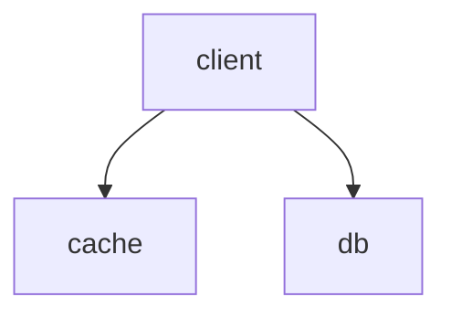

# cache db consistent protocol

### Model :

如图，有一个client，一个db和cache，如何保证缓存和DB之间的一致性？

### Algorithm：

缓存提供一个inc_version()函数功能，每次version加1；

- client写：
  - 首先使缓存失效,然后从inc_version()得到一个新的version
  - 然后将数据带着version写入db
- client读：
  - 首先读缓存，如果有数据直接返回
  - 如果没有数据，从db读数据，并将数据写入cache(写入时回检查version,如果version比当前cache计数器的version小，则写入失败，否则写入成功)，然后返回数据

### Correctness

1. 在没有并发读写的情况下，cache和db时刻一致，且返回正确数据
2. 若有并发读写，可以根据inc_ver和写cache的操作，把所有读写原子性的分开，则数据一致性可以保证

