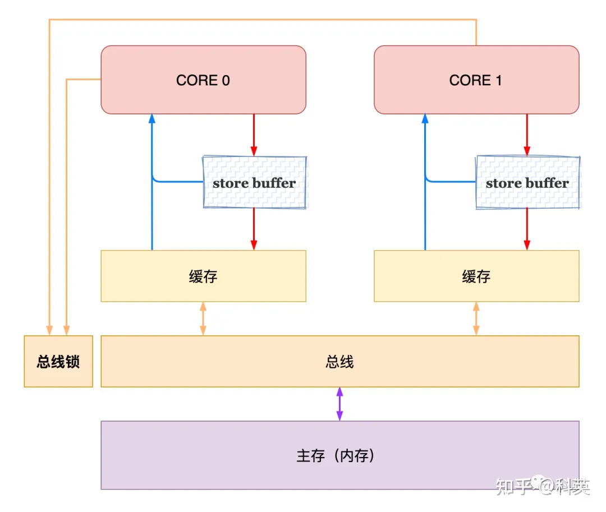
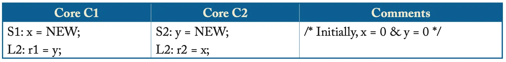

# Total Order and Concurrency 

## model

​	不管是分布式一致性问题，还是cpu内存一致性问题，抑或是数据库事务，多线程并发，本质上来讲都是需要一个全局的偏序或全序关系。

​	本篇文章将为X86 cpu建立一个序关系模型，并说明缓存一致性问题。

x86 cpu-TSO（ **Total Store Order**）的硬件结构如下：

x86-TSO规则如下：

- **Store Buffer** 被实现为 **FIFO** 队列，CPU 务必优先读取本地 **Store Buffer** 中的值（如果有的话），否则去缓存或内存里读取；

- 因为 **Store Buffer** 是 **FIFO**；

我们做出以下假设，并建立模型：

1. 总序性：所有原子事件的发生都有先后顺序，不会有两个同时发生的事件
2. 原子性：x86的R(x)为原子的，写W(x)不是原子的，是可以拆分成两个原子操作的，为push(x)，fin(x)，分别为push进入FIFO队列和fin结束写进主存
3. 依赖性：fin(x)和R(x)有数据依赖关系，push(x)与R(x)没有数据依赖关系
4. 合并性：相邻的push和fin可以进行和并，等价于原子的w(x)

最终目的：我们希望push和fin都可以消除，且消除之后，可以比较它与x86模型与顺序一致性(SC)的关系，关于顺序一致性，可以参考书目：(A Primer on Memory Consistency and Cache Coherence Second Edition).

## 例子

如下图所示。

r1和r2可以同时为0吗？

两个处理器核可以按照如下顺序执行代码：

1. C1执行S1，但将store NEW的请求放入write buffer中。
2. C2执行S2，但将store NEW的请求放入write buffer中。
3. 接下来，两个核心分别执行L1和L2，load的值都为0。
4. 最后，两个核心的write buffer将NEW值写入内存。

执行完毕后，r1和r2同时为0，违反了SC。

## safety

SC要求在以下所有四种连续执行指令的组合中保留load和store的程序顺序：

1. Load –> Load
2. Load –> Store
3. Store –> Store
4. Store –> Load

x86-TSO包含前三个约束，但不包括第四个。

证明如下：

1. 证明在一个历史中，所有的push和fin都可以消除为w(x)：由于fin操作为fifo的，所以push后的第一个不可以交换的操作，即为fin，所以一定可以合并。
2. 因此，任何一个历史，等价于 所有的Load指令不动，store指令都写在fin所在的位置，然后删除所有的push和fin，问题得证。

