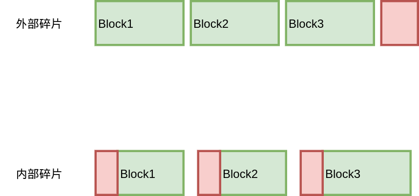

# memory allocator

## model

内存分配器对外主要提供两个接口，malloc(uint64_t)，free(void*),他的功能就是给所有app进程分配内存，如何设计一个好的内存分配器，主要有两个指标：

- 空间利用率：mm_malloc 或 mm_realloc 函数分配且未被 mm_free 释放的内存与堆的大小的比值。应该找到好的策略使碎片最小化，以使该比率尽可能接近 1
- 吞吐率：每单位时间完成的最大请求数，即要使时间复杂度尽可能小


下面将通过两个topic来阐述如何做到这两点：

1. 减少内存碎片
2. 从单线程到多线程分配


## 什么是内存碎片？

这基本上是一个地球人都知道的问题。。不过我还需要再唠叨一遍。所谓内存碎片，就是有一部分内存不能够分配给程序使用，因为它们以碎片的方式存在。内存碎片可以分两种，内部碎片和外部碎片，内部碎片是分配器分配的内存大于程序申请的内存，外部碎片是内存块太小，无法分配给程序使用。



那么，内存碎片来自于哪里呢？这个问题的答案取决于具体的内存分配算法，所以我们先来回顾一下经典的内存分配算法。

## 内存碎片-Freelist


首先是 free-list，通过链表，把内存中空闲块连接起来。分配的时候，找到大小合适的 Block，把它切分成两块，一块是待分配的大小，另一块放回 free-list；释放的时候，插入到链表中，并且合并一下前后的内存块方便下次分配。

分配的时候，选择哪块内存进行分裂？第一个满足大小的？还是大小最合适的？通常有 First-Fit、Next-Fit、Best-Fit这几种策略。

放回的时候，也有多种策略，可以直接放回链表头部（Last In First Out），最省事；或者按照地址顺序放回（Address-Ordered），使得链表中的空闲块都按照地址顺序排列。

free-list的内部碎片来自于固定大小的头部和尾部，用来记录内存块的大小以及这块内存的空闲与否，否则无从得知一个内存块的大小，以及前一个内存块的地址，后一个内存块的地址，也就无从进行内存合并了。

free-list的外部碎片则取决于分配和释放策略。通常来说，First-Fit策略会使得链表前面的大块内存被频繁分裂，从而造成较多的内存碎片；Best-Fit的内存碎片较少；放回时，采用Address-Ordered顺序能够增加内存合并的机会，相比于 LIFO 的碎片会更少。

这里有一个很有意思的策略是Address-Ordered。先看一下LIFO的情况：


首先这些内存块都是按地址排序的，3和5是空闲的，4是已分配的，3指向5。现在分别申请了3和5的内存，然后又释放了3和5，得到第二幅图的情况，指针变成了5指向3，因为直接把 3 和 5 插入到链表头部，LIFO策略。接下来再申请 3字节内存，按照 First-Fit策略，就会把 5的内存进行分裂。


如果采用Address-Ordered策略，放回3和5时，指针顺序还是从3指向5。那么再次申请3字节内存时，直接分配原有的3，而不需要分裂5的内存。

一些研究表明，采用Address-Ordered策略能够显著降低内存碎片，不过其实现较为复杂，释放内存的复杂度较高。

## 内存碎片-Segregated-Freelist

上面的 Freelist 都可以申请和释放任意大小的内存块，而将大的内存块和小的内存块放在一起很容易带来内存碎片，因此就有了 Segregated-Freelist，每个 Freelist 存储不同大小的内存块。


在Seglist中，就无需 Boundary-Tag 去存储内存块的大小信息了，只需要实现从地址到Seglist的映射即可，例如TCMalloc中使用的PageMap就是一种方式。

看起来可以减少内部碎片，但是问题随之而来，每个Freelist都存储固定大小的内存块，如果申请9字节数据，可能就要分配16字节，带来的内存碎片反而更多了！因此，虽然按照2的幂级数去分配是一种很简单的策略，但是它并不高效。解决方案也有不少，例如分配 2^N 和 3*2^N 的内存块。

至于外部碎片的问题，Seglist也同样存在，不过不是那么明显。因为在分配Freelist的时候，通常按照内存 Page为单位，如果块大小不是 Page 的约数，就会有外部碎片了。

Segregated-Freelist 还有一个变种，称之为 Segregated-Fit。每个Freelist 不再是存储固定大小的内存块，而是存储一定范围的内存块。大名鼎鼎的 Doug Lea内存分配其（dlmalloc）就使用了这种策略。

## 内存碎片-Buddy-System

伙伴系统也是一种很经典的分配算法。


按照一分为二，二分为四的原则，直到分裂出一个满足大小的内存块；合并的时候看看它的 Buddy 是否也为空闲，如果是就可以合并，可以一直向上合并。

伙伴系统的优势在于地址计算很快，对于一个内存块的地址，可以通过位运算直接算出它的 Buddy，Buddy 的 Buddy，因此速度很不错。

不过考虑内存碎片，它并没有什么优势，像图中的这种经典的 Binary Buddy，全部都是2的幂级数，内部碎片还是会达到 50%。当然也有一些其他的优化，块大小可以是3的倍数之类的。

## 内存分配算法的比较

对于以上的几种算法，实际会产生的内存碎片会有多少呢，有人专门做过测试比较：


Frag#3和Frag#4分别是两种不同的度量方法，一个是分配器申请内存最大时，程序分配的内存和分配器申请的内存，另一个是程序最大申请的内存和分配器最大申请的内存。测试时使用了实际的程序进行模拟，例如GCC之类内存开销较大的程序。

这里有几个比较夸张的值，例如simple seg的1468%，这是因为碎片率的度量仅仅考虑分配器申请的内存和程序分配的内存，存在一定误差。不过对于 best fit AO来说，其内存碎片显然是相当少的，而一些在我们看来比较朴素的算法，first fit，其内存碎片率其实也相当低，反而是 buddy system 和 segregated list 比较尴尬。

不过这篇文章说明的核心观点是，只要选择了合适的策略，其内存碎片就完全不用担心，只要关心实现的性能就可以了，程序员也不用再手写内存分配器什么的了。

## TCMalloc的内存碎片

TCMalloc采用了 Segregated-Freelist 的算法，提前分配好多种 size-class，在64位系统中，通常就是 88 种，那么问题来了，这个怎么计算？

首先看一下结果：8， 16， 32， 48， 64， 80， 96， 112， 128， 144， 160， 176......

TCMalloc 的目标是最多 12.5% 的内存碎片，按照上面的 size-class算一下，例如 [112, 128)，碎片率最大是 ([128-112-1](tel:128-112-1))/128 = 11.7%，([1152-1024-1](tel:1152-1024-1))/1151 = 11.02%。当然结果是满足 12.5% 这一目标的。

要生成一批满足碎片率的 size-class 其实也有多种方法，比如，[x, y)区间内，只要满足 (y-x-1)/y <= 0.125即可，即 y <= 8/7*(x+1)，从前往后递推一下就可以得到这些结果了，另外再考虑一下字节对齐什么的，就可以得到不错的结果。

不过 TCMalloc 从另一个角度来考虑这个问题的：从 size 到 size-class，需要进行一次向上对齐（round-up），例如 17 对齐到32；其实也是进行了一次字节对齐（Alignment），把 17 以 16 字节进行对齐，(17 + 15) / 16 * 16 = 32。

那么，内存碎片率其实就是 (Alignment-1) / SizeClass。那么我们只需要保证每个SizeClass它的 Alignment 满足 (Alignment-1)/SizeClass <= 0.125 就能满足需求了。

例如，对于 size-class 1024，下一个size-class 就是 1024 + 1024 / 8 = 1152，其中 Alignment 是1024/8=128；那么1152，我们是按照 1152/8=144，还是按照128计算 Alignment 呢，我们选一个比较好看的数字 128 计算出下一个 size-class。好吧，为什么是128呢，因为是把 1152 向下对齐到了2的幂级数1024，（这里的原因我就不是那么清楚了）。得到的代码如下：

```go
func InitSizeClass() []int {
	alignment := 8
	classToSize := make([]int, 0, 88)
	for size := alignment; size <= 256*1024; size += alignment {
		alignment = align(size)
		classToSize = append(classToSize, size)
	}
	return classToSize
}
```

代码非常简单，不过省略了 align 这个函数的实现：

```go
func align(size int) int {
	aligment := 8
	if size > 256*1024 {
		aligment = PageSize
	} else if size >= 128 {
		aligment = (1 << uint32(lgfloor(size))) / 8
	} else if size >= 16 {
		aligment = 16
	}
	if aligment > PageSize {
		aligment = PageSize
	}
	return aligment
}
```

计算 Alignment 的时候，大于 256 × 1024就按照Page进行对齐；最小对齐是8；在128到256×1024之间的，按照 1<<lgfloor(size) / 8进行对齐。等等，说好的向下取整到 2的幂级数然后除以8呢？

其实 lgfloor 就是用二分查找，向下对齐到2的幂级数的：

```go
func lgfloor(size int) int {
	n := 0
	for i := 4; i >= 0; i-- {
		shift := uint32(1 << uint32(i))
		if (size >> shift) != 0 {
			size >>= shift
			n += int(shift)
		}
	}
	return n
}
```

先看左边16位，有数字的话就搜左边，否则搜右边。。。

到这里，基本上完成了 size-class的计算（TCMalloc 还有一个优化）。

## TCMalloc的外部碎片

上面的 size-class 保证了内部碎片基本在 12.5%以下，但是外部碎片呢？

外部碎片是因为 CentralCache 在向 PageHeap 申请内存的时候，以 Page 为单位进行申请。举个例子，对于 size-class 1024，以一个Page（8192）申请，完全没有外部碎片；但是对于 size-class 1152，就有 8192 % 1152 = 128 的碎片。为了保证外部碎片也小于 12.5%，可以一次多申请几个Page，但是又不能太多造成浪费。

```go
func numMoveSize(size int) int {
	if size == 0 {
		return 0
	}
	num := 64 * 1024 / size
	return minInt(32768, maxInt(2, num))
}

func InitPages(classToSize []int) []int {
	classToPage := make([]int, 0, NumClass)
	for _, size := range classToSize {
		blocksToMove := numMoveSize(size) / 4
		psize := 0
		for {
			psize += PageSize
			for (psize % size) > (psize >> 3) {
				psize += PageSize
			}
			if (psize / size) >= blocksToMove {
				break
			}
		}
		classToPage = append(classToPage, psize>>PageShift)
	}
	return classToPage
}
```

这里计算出来的结果，就是每个 size-class 每次申请的 Page 数量，保证12.5%以下的外部碎片。

到这里基本能够保证内部碎片和外部碎片都在 12.5% 以下了，但 TCMalloc 还没有就此止步。。

## size-class的合并

在我们上面计算出来的size-class中存在一些冗余，比如 1664，1792。它们都是一次申请2个Page，1664 可以分配出 8 * 1024 * 2 / 1664 = 9 个对象，1792也是可以分配出 8 * 1024 * 2 / 1792 = 9 个对象，那么，区分这两个 size-class有意义吗？1664浪费的内存是 8*1024*2%1664=1408, 1792浪费的内存是 8*1024*2%1792=256，1792浪费的内存反而更少一点。因此都保留并不能让这2 个Page 发挥更大的价值，所以，我们干脆把这两个合并了，仅仅保留 1792，结果并不会更差。

不过还有一个问题，如果我们计算一下[1536, 1792)的碎片，会发现 （1792-1536+1) / 1792 = 14.28% ，怎么大于 12.5 % 了？略尴尬。这也意味着，申请 1537字节，它的实际碎片率是 (8192*2 - (8192*2/1792*1537)) / (8192 * 2) = 15.57%，还是大于了 12.5% 的承诺。。

这里会发现，虽然内部碎片小于 12.5%，外部碎片也小于 12.5%，但是它们加在一起就大于12.5%了，很悲伤的故事。。不知道 Sanjay是有意为之，还是无心之过。

## size到size-class

还有一个小的问题，如何从size 计算出 size-class。最简单的最大是二分查找，用std::upper_bound 就可以搞定，不过对于88个size-class，O（LogN）需要7次查找，还是有些多，随之带来的 cache miss 可能又会加剧问题。

另一个方法是打表，因为所有size-class都是至少8字节对齐的，我们把 256×1024 所有 8 字节对齐的数都打表，就能用O（1）的复杂度查找到 size-class，不过这种方法略废内存，cache locality可能也不会太好；观察一下发现，大于1024的 size-class 其实都以128对齐，那么这个表就可以分两段，小于1024和大于1024，省了很多内存。具体的计算就不再赘述。


## 从单线程到多线程 -- mimalloc

mimalloc是专门为多线程应用设计的一款高性能的内存分配器，能极大降低多线程环境下线程间同步带来的性能下降。与tcmalloc类似，mimalloc采用了线程本地缓存的设计，同时采用了复杂的缓存管理机制提升内存分配和释放的速度。此外，mimalloc的内存分配/释放算法是lock-free的，意味着它是async-signal-safe（可以在signal handler内调用）。

这篇文章主要介绍mimalloc中的四个关键数据结构：tld（thread local data）、heap、page、segment，以及与之关联的一些算法流程，以使得我们对mimalloc在达到稳态后是如何实现高性能有个大致的了解。

## thread local data

大多数高性能内存分配器产品都会实现自己的内存池（缓存），以减少系统调用（mmap）的次数。mimalloc将缓存进一步划分到各个线程中，各线程的内存分配都走线程本地缓存（tld），最大程度避免了内存分配时线程间的（锁）竞争。


mimalloc的cache结构

一个tld主要由heap和segment两部分构成，它们共同组成了一个二级缓存系统：

**heap**：面向上层应用的一级缓存，是分配内存时的第一搜索位置。其内部使用了相当巧妙的结构和算法来组织和管理内存块，以实现内存块的快速索引和改善连续内存分配时的局域性

**segment**：面向heap的二级缓存，是通过mmap申请的连续大内存区域（32MB），起到了缓冲heap频繁调整大小的作用

虽然内存一定走线程本地的heap分配，但内存被分配后可能会传递到其它线程并由其负责释放（归还到原线程的tld），因此不可避免地导致多线程竞态的风险。后面我们会看到，mimalloc通过free-list分片的方式极大地分散了内存跨线程释放时的竞态风险。

## heap

heap以page为单位进行内存管理，page是一组大小固定的block序列（但不同page的block size可以不同），后者是内存分配所返回的对象。


mimalloc的heap结构

不同于传统内存分配器使用单free list管理一个size class的所有block，mimalloc将free list以page为单位进行分片：每个free list只管理所属page的block，block的大小即为free list的size class。


free list分片前后的对比

这样做的第一个好处是**减少跨线程内存释放时多线程竞争的概率**：一般来说应用的线程数（几十）远少于page数（几万），如果不出现极端的hot page现象竞争的概率很小。

这样做的第二个好处是**连续分配的内存块有更好的内存局域性**：大多数应用长期运行后都会有内存碎片化问题，传统的单free list会导致结构复杂的对象的内存分散在整个heap上；而分片free list则更可能将对象的内存聚集到单个page上，降低cache miss（主要是L2和L3）的概率。

由于进行了分片，因此内存分配时原则需要至少两次转跳才能找到合适的free-list：第一次找到对应size class的free list集合（或者说，page queue），第二次从page queue中找到有空闲block的free list。


类buddy系统的page管理

但这样查找的效率很低，尤其是从集合查找有空闲block的page：最坏情况下要遍历整个page_queue。因此mimalloc额外设置了一个特殊的full page queue：每当检测到page无可用block时，就把它转移到full page queue；当有block释放回full page时，再将其移回对应page queue，以保证大部分情况下page queue的第一个page可用。


full page集中管理

然而，这个看似简单的优化极大地复杂化了多线程同步的逻辑：当一个full page因为跨线程内存释放导致它不再full了，谁负责把它放回原位？由释放线程来做并不现实，因为这个过程涉及到多个数据，很难用无锁的方式实现。

因此，mimalloc为跨线程内存释放额外增加了一套流程：当page处于full page_queue时，将block暂存到delayed_free缓存队列而非归还到page，由本地线程定期从缓存队列中取出并归还至相应page，同时将page转移回原page queue。


full page跨线程释放时的延迟free

至于本地线程是如何实现定期从delayed_free中收集并归还block到对应full page，后面我们会看到，mimalloc通过对page内的free list再一次分片实现了这种类似于定期心跳的回收机制。

## page

page是mimalloc中内存管理的最小单位（block太简单，忽略不计），它由大小固定block序列和元数据组成，这些block由隶属于page的free list组织：当进行内存申请时，最终返回的就是free list中第一个block。


page的内存结构

不过，page中的空闲block并非只由一条free list组织，mimalloc在page的基础上再次对free list进行了分片：供内存分配的free、供本地线程内存释放的local-free、供其它线程内存释放的thread-free


page内部的free list分片

- free list：上层应用请求分配内存时block的直接来源，大部分时间直接pop-from-head即可，只有在变空时才从另外两条free list补充block
- local-free list：上层应用（同一线程）释放内存时block的直接归处，大部分时间直接push-to-head即可
- thread-free list：上层应用（跨线程）释放内存时block的直接归处，通过lock-free算法实现push-to-head

将thread-free分片出来的原因很直观：在大部分时间内**将本地线程的malloc/free和其它线程的free隔离开**，使得线程竞争的时机集中延迟到free为空需要从另外两条free链表补充时，进一步减小了竞争的概率

将local-free分片出来的原因则较为间接：一方面是**提供了一种定期检查的机制**，保证一个page在经过固定次数malloc后一定会触发内存回收逻辑，不仅包括从local-free和thread-free中回收block，还包括从上一节中介绍的`heap->delayed_free`中回收block。另一方面，对于使用了引用计数的语言运行时而言，释放大对象（直接或间接引用了大量资源的对象）时会触发大量的引用递减操作，其中一个优化便是使用所谓延迟引用递减（deferred decrement）的机制，mimalloc所提供的定期回收机制使得语言运行时可以将引用递减推迟到内存压力紧张时执行。

## segment

heap、page、block内存并非凭空而来，它们最终源于内核为我们分配的匿名内存段——通过mmap系统调用的方式。然而后者的开销是昂贵的，因此mimalloc设置了尺寸较大的segment作为heap和内核之间的缓冲，以减少mmap/munmap的调用次数


segment内存布局

segment结构较为简单：一块连续的大内存（32MB），以64KB为单位划分成500个slice，其中头部slice区域用于存储segment的元数据。在heap需要拓展page时，会从segment中拿走由若干slice构成的序列——所谓的slice span，作为page的原始内存。

当然，和heap一样，在长时间使用后segment中的内存也会呈碎片化的形式：空闲的和被占用的slice交替出现，导致寻找目标尺寸的slice span变得困难；同时，一个tld可能会持有多个segment，如何选择一个合适的segment也是一个问题。

为了让heap在page不足时能够迅速从segment中找到合适的slice span，mimalloc将slice span按大小分类成不同的size class，并为每个size class分配一个slice span queue，用于存储所有segment中该size class的所有slice span——类似于heap按block大小分类管理page那样。


类buddy系统的slice span管理

当heap需要从segment中申请长度为n的slice span时，会先计算出n对应的size class下标bin，从而找到该size class的slice span queue。若span queue非空，则将第一个slice span作为搜索结果；若span queue为空，则向size class更大的span queue查找，直至找到第一个非空的span queue。

由于返回的slice span大小可能大于实际page所需，因此会将多余部分裁剪出来的作为新的span，并添加到对应size class的span queue，以避免浪费

## 总结

mimalloc采用one-cache-per-thread的设计减少了内存分配和释放时线程间的竞争，各线程从本地的heap请求内存即可；heap以page为单位对free list进行了分片，大幅降低了跨线程内存释放时的竞争概率以及提高了连续内存分配的局域性；page在此基础上对free list做了进一步的分片，分隔了本地线程malloc/free和跨线程free流程之间的耦合，同时为上层提供了一种定期触发的回收机制；最后，segment充当了heap和内核之间的缓冲，减少了mmap/munmap等昂贵的系统调用频率。

要注意的是，这里只是介绍了mimalloc基本的数据结构和内存管理算法，对于更细节但同样重要的问题并没有涉及，比如：在保证速度的同时如何兼顾内存使用率、如何避免page/cache effect（频繁访问cache line偏移相同的地址导致的高cache miss效应）、如何实现内存安全性（防破解），等等。
