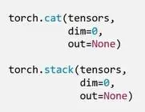
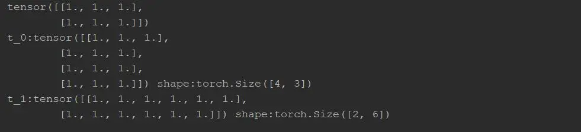
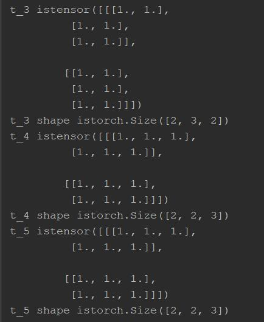
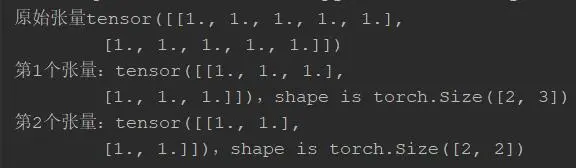
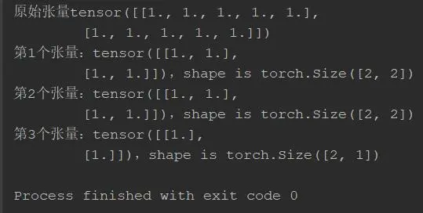
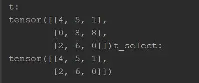
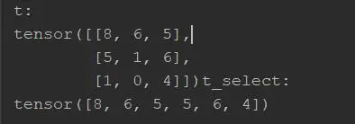
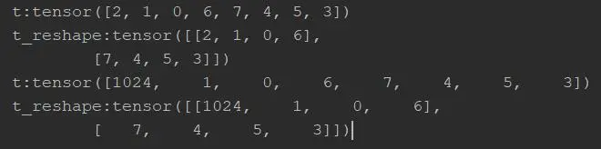
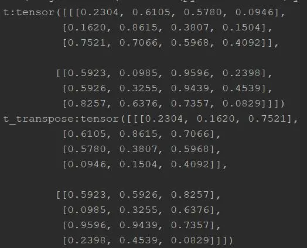
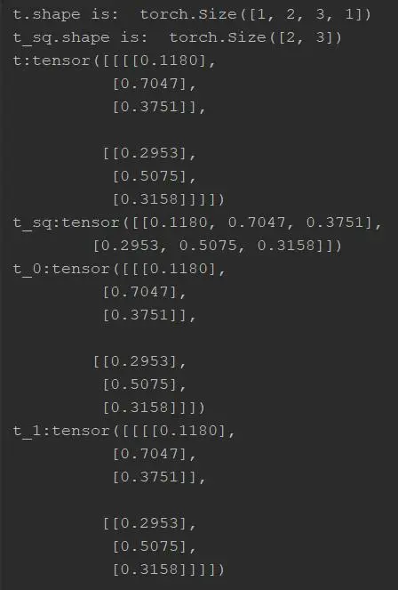

## **Tensor的操作与变换**

在学习了Tensor的创建方法之后，接下来你可能会问：那么我们可以对Tensor进行哪些操作呢？

不急，今天我们就来聊聊Tensor的操作方法。这部分主要包含两类：

- Tensor的基础操作：如拼接、切分、索引和变换
- Tensor的数学运算

## **02 | Tensor基础操作**

### **021 | Tensor的拼接**

当我们想拼接两个张量（Tensor）时，可以选用两种方法，一类是“**torch.cat()**”，一类则是“**torch.stack()**”。

torch.cat()的功能是将张量按制定的维度参数（dim）进行拼接，并返回一个新张量，其关键参数有二：

- tensors：要拼接的张量序列
- dim：要进行拼接的维度

这里的维度指的是张量所张开的维度，如（3,2）从第0维度看（投影）有3个“元素”，而第1维度则有2个“元素”。

torch.stack()与torch.cat()的不同在于，拼接张量时会在指定的维度（dim）上插入一个新维度，得到一个维度增加后的张量。





为了进一步演示其作用，我们在PyCharm上运行测试代码：

```python
# 测试torch.cat()的拼接作用 
flag = True 
if flag:    
        # 创建一个（2,3）张量        
        t = torch.ones((2,3))        
        print(t)            
        t_0 = torch.cat([t, t], dim=0)        
        t_1 = torch.cat([t, t], dim=1)            
        print("t_0:{} shape:{}\nt_1:{} shape:{}".format(t_0, t_0.shape, t_1, t_1.shape))
```




上例展示了torch.cat()在不同维度上拼接的作用，原有的(2,3)张量可以看作是在两个维度上分别张开的张量，当dim=0时指定第一个维度，该维度上每个张量均有2个元素，因此拼接后可以得到(4,3)的新张量（多维数组）；当指定dim=1时指定第二个维度，该维度上张量有3个元素，因此拼接后得到(2,6)的新张量。

当我们采用**torch.stack()**拼接时，会在原有的维度上添加新维度，此时需要将原始张量看作是多维矩阵，重新分配元素并计算张量中各部分大小。

```python
# 测试torch_stack()拼接张量 
# 在新维度2上拼接，原有t是2×3，两个t拼接后变成12个元素，那么拼接后形状为（2,3,2），意思为“2个3×2矩阵” 
t_3 = torch.stack([t, t], dim=2) 
print("t_3 is{}\nt_3 shape is{}".format(t_3, t_3.shape)) 
# 在第1个维度前插入个新维度，原有维度降级 
t_4 = torch.stack([t, t], dim=0) 
print("t_4 is{}\nt_4 shape is{}".format(t_4, t_4.shape)) 
# 在第1个和第2个维度间插入了新维度 
t_5 = torch.stack([t, t], dim=1) 
print("t_5 is{}\nt_5 shape is{}".format(t_5, t_5.shape))
```





### **022 | Tensor的切分**

既然可以将两个张量拼接起来，那么自然也可以将一个张量进行切分。一种常见的方法是基于“**torch.chunk()**”的平均切分方法，该方法返回切分后的张量列表，需要注意的是，当切分数量不能整除时，最后一份张量小于其他张量。

其中重要的参数有三项：

- input：表示是要切分的张量
- chunks：要切分的份数
- dim：要切分的维度

此时可以在PyCharm中运行测试代码，可以发现当指定dim=1时，实际是从原始张量的列张开方向予以均分的，但是由于原始张量有5列，均分2.5，四舍五入为3，则最后一个张量只有（5-3）=2列，即2×2的方阵。

```python
# **************************** example **************************** # 通过torch.chunk()平均切分张量 
flag = True 
if flag:   
        a = torch.ones((2, 5))       
        print('原始张量{}'.format(a))        
        list_of_tensors = torch.chunk(a, dim=1, chunks=2)        
        for idx, t in enumerate(list_of_tensors):              
        print('第{}个张量：{}，shape is {}'.format(idx+1, t, t.shape))
```




除去统一均分的切分方式外，torch还提供了“torch.split()”方法提供更加灵活强大的张量切分方式，此时可以将张量按维度dim和指定长度进行切分（未必均分）。其主要参数为：

- tensor：表示要切分的张量
- split_size_or_sections：当为int类型，表示每一份的长度；若为list类型，则按list元素切分
- dim：表示要切分的维度

同样在PyCharm中运行测试代码，可见当指定分片长度=2时，从5列中依次选取2列构成一个张量，而最后1列单独构成一个张量。

```python
if flag:    
        a = torch.ones((2, 5))        
        print('原始张量{}'.format(a))     
        # 指定切分后每部分长度为2，最后一部分因为不够而小于2        
        list_of_tensors = torch.split(a, 2, dim=1)        
        for idx, t in enumerate(list_of_tensors):           
            print('第{}个张量：{}，shape is {}'.format(idx+1, t, t.shape))
```




感兴趣的同学还可以试试修改为列表[2,1,2]时切分的效果。

> list_of_tensors = torch.split(a, [2,1,2], dim=1)

### **023 | Tensor的索引**

PyTorch也为我们提供了查找特定元素数值的方法，即通过“索引”实现。 第一种索引的方法是“**torch.index_select()**”，其功能为在指定的维度dim上，基于索引index查找返回数据，最终返回基于index索引数据拼接的张量。其主要参数为：

- input：要索引的张量
- dim：要索引的维度
- index：要索引数据的序号

照旧我们在PyCharm上运行测试代码，如此更加直观形象。从实验中可以看出，原始张量为从[0,9)中随机选取数值构建的3×3方阵（矩阵或二维数组），指定dim=0即意味着从“行向量”角度索引，基于索引张量Tensor(0,2)可以确定索引第0行和第2行输出返回。

需要注意的是，这里的索引张量必须是torch.long类型，不能是float。

```python
# 采用torch.index_select()索引张量中数据 
flag = True 
if flag:   
        t = torch.randint(0, 9, size=(3,3))          
        idx = torch.tensor([0, 2], dtype=torch.long)        
        t_select = torch.index_select(t, dim=0, index=idx)        
        print("t:\n{}t_select:\n{}".format(t, t_select))
```




那么我们是否可以类似于正则表达式一样的规则进行索引呢？当然可以！ 此时我们需要借助“torch.masked_select()”方法，按mask中的True值项进行索引，但是由于并不知晓符合True值的数据个数，因而只返回一个一维张量（数组）。其主要参数为：

- input：要索引的张量
- mask：与input同形状的布尔类型张量

由实验中可以看出，当采用布尔型张量t.ge(4)时（表示所有大于等于4的数值），可以借助torch.masked_select正确筛选出所有大于等于4的数据，并返回一维张量。

```python
# 采用torch.masked_select()正则性索引张量 
flag = True 
if flag:   
        t = torch.randint(0, 9, size=(3,3))        
        mask = t.ge(4) # gt is mean greater than or equal, gt/le/lt        
        t_select = torch.masked_select(t, mask)       
        print("t:\n{}t_select:\n{}".format(t, t_select))
```





### **024 | Tensor的变换**

我们再介绍一种Tensor的变形操作，如“**torch.reshape()**”功能是变换张量形状，注意当张量在内存中是连续时，新张量与input共享数据内存，其主要参数为：

- input：要变换的张量
- shape：表示新张量的形状

由于变形仅仅是从人类观察视角发生了变化，因此并不改变原始数据的属性。这里有几点需要注意：

1）torch.reshape()的shape参数中，若出现“-1”则表示对该维度不关系，则基于给定的“4”确定该维度数值即可；

2）默认内存连续情况下，变形前后的张量共享内存，故而修改后发生连锁反应。

```python
# 借助torch_reshape()改变张量形状 
flag = True 
if flag:    
        t = torch.randperm(8)        
        t_reshaple = torch.reshape(t, (-1, 4))        
        print("t:{}\nt_reshape:{}".format(t, t_reshaple))      
        # 测试修改张量数据会影响原始张量     
        t[0] = 1024        
        print("t:{}\nt_reshape:{}".format(t, t_reshaple))
```




除去常用的torch.reshape()之外，训练模型过程中还常用到矩阵转置，可以借助**torch.transpose()**交换张量的两个维度，其主要参数为：

- input：要变换的张量
- dim0：要交换的维度
- dim1：要交换的维度

我们还是通过PyCharm代码来说明。可以看到借助torch.transpose()方法，将原先的2个3×4张量，转变为了2个4×3张量，而且原有张量元素的坐标发生了转置交换，如0.1620数据初始索引为index(1,0)，而交换后变为了index(0,1)，作用上实现了矩阵转置。

为了简洁需要，也可以使用“torch.t()”实现二维张量的转置，其相当于“torch.transpose(input, 0, 1)”。

```python
# 测试torch.transpose()转置交换维度 
flag = True 
if flag:   
        t = torch.rand((2, 3, 4))        
        t_transpose = torch.transpose(t, dim0=1, dim1=2)        
        print("t:{}\nt_transpose:{}".format(t, t_transpose))
```





### **025 | 张量的压缩**

最后简要介绍一种张量压缩的操作，即借助方法“**torch.squeeze()**”实现压缩长度为1的维度（轴），其重要参数为“dim”，若设置为None时，则移除所有长度为1的轴；若指定维度，当且仅当该轴长度为1时，可以被移除。

同样地，我们有对应的扩展维度方法“torch.unsqueeze()”，其中参数“dim”指定扩展的维度。

同理在PyCharm中运行测试代码。

初始张量维度为（1,2,3,1），当使用torch.squeeze(）时，默认所有长度为1的轴，即移除了第0和第3个维度，则压缩后t_sq应为(2,3)维度。 若指定的维度长度不为1，则不移除；反之也移除该维度。t_0的第0维度移除，而t_1的第1维度未进行移除。

```python
# 测试torch.squeeze()压缩张量 
flag = True 
if flag:    
        t = torch.rand((1, 2, 3, 1))        
        t_sq = torch.squeeze(t)        
        t_0 = torch.squeeze(t, dim=0)        
        t_1 = torch.squeeze(t, dim=1)        
        print(t.shape)        
        print(t_sq.shape)        
        print("t:{}\nt_sq:{}\nt_0:{}\nt_1:{}".format(t, t_sq, t_0, t_1))
```





## **03 | Tensor的数学运算**

Tensor常用的数学运算主要涉及三类：加减乘除基本运算、对数+指数+幂函数运算以及三角函数等。

数学运算方法相对简单，日后用到时随时查阅资料即可。

常见的四则运算方法有：**torch.add() | torch.addcdiv() | torch.addcmul() | torch.sub() | torch.div() | torch.mul()**等

常见的对数指数运算有：**torch.log() | torch.log10() | torch.log2() | torch.exp() | torch.pow()**等

常见的三角函数运算有：**torch.abs() | torch.acos() | torch.cos() | torch.cosh() | torch.asin() | torch.atan() | torch.atan2()**等。

其中torch.add()有些特殊，主要是为了便于神经网络运算，预定义了乘项因子，如torch.add(X, α, Z)的作用是计算下述公式，这里的X和Y均为张量。