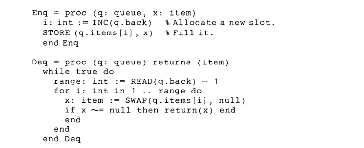

# 验证线性一致性

如何验证线性一致性一直是一个较难的问题，甚至可以是一个NP Hard的问题，但是还是有一些代码的线性一致性是比较好验证的，下面给出一个验证的例子。

## model

线性一致性的定义：

- 对于任意一个历史，我们都可以找到一种映射，把所有操作简化为invoke和response，并变为顺序执行
- 这个顺序执行，保留了原来的偏序关系

## 例子 -- 线性一致性的queue

1. 首先定义invoke和response，对于enq操作：INC为invoke，STORE为response。对于deq操作：READ为invoke，！=null return为response；
2. 定义一种映射或使用归纳法：对于任意的一个由这段代码生成的历史，对于一个或两个操作，一定满足线性一致性，如果N个操作满足，则N+1个操作-->首先找到第一个写操作，如果没有并发，则将他和对应的读操作删去，剩余N-2个，这种组合满足线性一致性。如果写操作有并发，选取并发中的写操作对应的读操作的第一个，删去，剩余N-2个满足线性一致性，如果读操作也有并发，则随便选两个，删去，剩余的N-2个满足线性一致性。
3. 然后把这两个操作插进去，仍然满足线性一致性